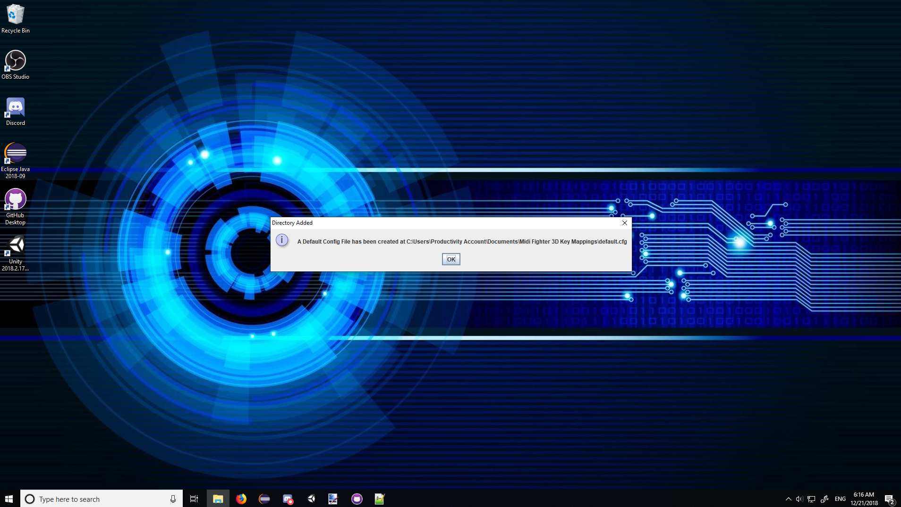
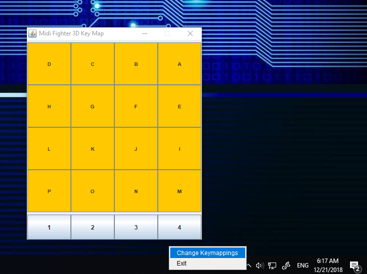
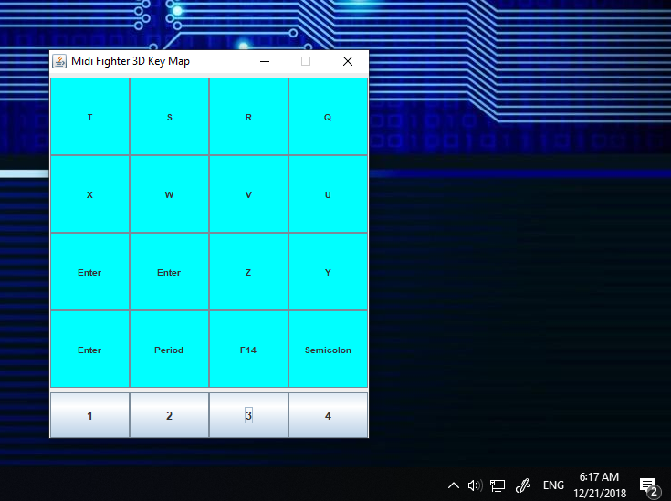
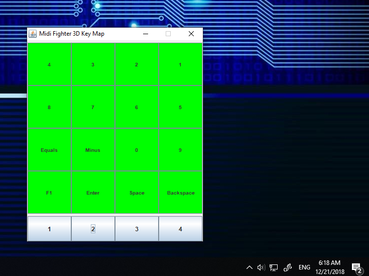
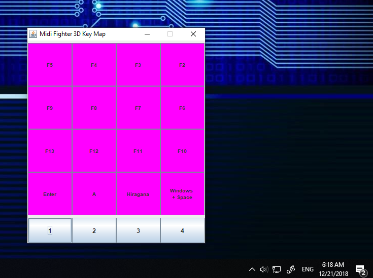
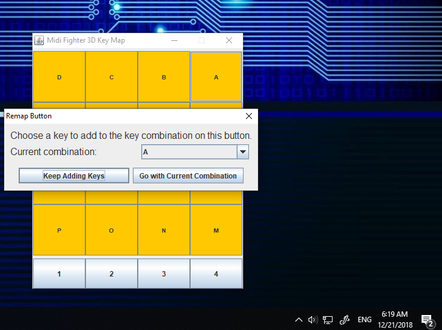
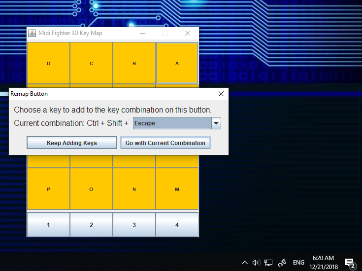
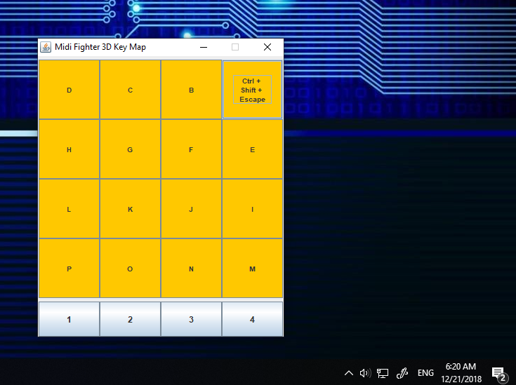

# MidiFighter3DKeyMapper

A Simple Midi Input Key Remapping tray application designed with the Midi Fighter 3D in Mind.

## Usage

I've included a folder containing all of the builds that I'd made along the way while I was developing this (offline didn't think to use a versioning system at the time). Running it is pretty simple, If you have Java installed, just run the jar file of the newest version (or any version if you want bugs and less features XD).  
  
Take note that this program is a tray application based program and it will start up and run in the background as a tray icon.  
  
On that note, Here's a little tutorial of how this thing works.  
  
- When you run the program for the first time, it will create a new config file containing your keymappings in your documents folder (it should be able to detect the location in case you changed it from the default)   
- You should then be able to see the program running in your system tray 
- If you right click on the application, you can either exit it, or open up the keymapping GUI   
- If you open the keymapping GUI then you can change the currently set Keymappings. Take note that the colors here are modeled after my own Midi Fighter 3D and it defaults to 4 when opening.    
- If you want to change a keymapping (or to disable it) you can click on any of the buttons displaying the keymapping and this nice GUI will pop-up prompting you to select the key combination you want. 
- You can have as many or as few keys to be pressed at once as you want 
- When you are happy with your combination, you can just click "Go with Current Combination" and the changes will immediately take effect   
  
Well If anyone happens to stumble upon this and finds it as useful as I did, enjoy (＾ω＾)b